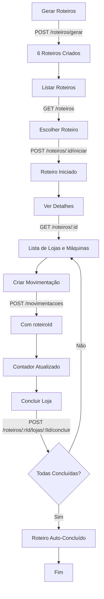

# Sistema de Roteiros - Implementação Backend

## 📋 Resumo das Alterações

Este documento resume todas as alterações implementadas no backend para suportar a funcionalidade de roteiros.

## 🗂️ Arquivos Criados

### Models
- `src/models/Roteiro.js` - Model do roteiro
- `src/models/RoteiroLoja.js` - Relacionamento roteiro-loja
- `src/models/RoteiroGasto.js` - Gastos do roteiro

### Controllers
- `src/controllers/roteiroController.js` - Todos os endpoints de roteiros

### Routes
- `src/routes/roteiro.routes.js` - Rotas de roteiros

### Migrations
- `src/database/migrations/add-roteiros-tables.js` - Migration completa

### Scripts
- `run-migration-roteiros.js` - Executar migration via Node.js
- `migration-roteiros.sql` - Migration manual via SQL
- `test-roteiros-endpoints.js` - Testes dos endpoints

### Documentação
- `ROTEIROS_MIGRATION_GUIDE.md` - Guia completo da migration
- `ROTEIROS_IMPLEMENTACAO.md` - Este arquivo

## 📝 Arquivos Modificados

### Models
- `src/models/Loja.js` - Adicionado campo `zona`
- `src/models/Movimentacao.js` - Adicionado campo `roteiroId`
- `src/models/index.js` - Adicionados relacionamentos dos novos models

### Controllers
- `src/controllers/movimentacaoController.js`
  - Adicionado suporte ao campo `roteiroId`
  - Adicionada lógica para atualizar contador de máquinas concluídas

- `src/controllers/maquinaController.js`
  - Adicionado query param `incluirUltimaMovimentacao`
  - Retorna última movimentação de cada máquina quando solicitado

### Routes
- `src/routes/index.js` - Registrada rota `/api/roteiros`

## 🗄️ Estrutura do Banco de Dados

### Novas Tabelas

#### `roteiros`
```
id                  UUID PRIMARY KEY
data                DATE
zona                VARCHAR(50)
estado              VARCHAR(2)
cidade              VARCHAR(100)
status              VARCHAR(20) DEFAULT 'pendente'
funcionarioId       UUID
funcionarioNome     VARCHAR(100)
totalMaquinas       INT DEFAULT 0
maquinasConcluidas  INT DEFAULT 0
saldoRestante       DECIMAL(10,2) DEFAULT 500.00
createdAt, updatedAt
```

#### `roteiros_lojas`
```
id          UUID PRIMARY KEY
roteiro_id  UUID REFERENCES roteiros(id)
loja_id     UUID REFERENCES lojas(id)
concluida   BOOLEAN DEFAULT FALSE
ordem       INT
createdAt, updatedAt
```

#### `roteiros_gastos`
```
id          UUID PRIMARY KEY
roteiro_id  UUID REFERENCES roteiros(id)
categoria   VARCHAR(50)
valor       DECIMAL(10,2)
descricao   TEXT
createdAt, updatedAt
```

### Campos Adicionados

- `lojas.zona` - VARCHAR(50)
- `movimentacoes.roteiro_id` - UUID REFERENCES roteiros(id)

## 🚀 Endpoints Implementados

| Método | Endpoint | Descrição |
|--------|----------|-----------|
| GET | `/api/roteiros` | Lista roteiros (filtrar por data) |
| POST | `/api/roteiros/gerar` | Gera 6 roteiros automáticos |
| GET | `/api/roteiros/:id` | Detalhes de um roteiro |
| POST | `/api/roteiros/:id/iniciar` | Inicia roteiro |
| POST | `/api/roteiros/:roteiroId/lojas/:lojaId/concluir` | Marca loja como concluída |
| POST | `/api/roteiros/:id/concluir` | Finaliza roteiro |
| GET | `/api/maquinas?lojaId=:id&incluirUltimaMovimentacao=true` | Máquinas com última movimentação |
| POST | `/api/movimentacoes` | Criar movimentação (adicionado campo `roteiroId`) |

## 📦 Como Instalar

### 1. Executar Migration

**Opção A: Via Node.js (Recomendado)**
```bash
node run-migration-roteiros.js
```

**Opção B: Via SQL**
```bash
psql -U seu_usuario -d seu_banco -f migration-roteiros.sql
```

### 2. Atualizar Lojas com Zona

Após a migration, atualize as lojas existentes com a zona:

```sql
UPDATE lojas SET zona = 'Norte' WHERE cidade IN ('...', '...');
UPDATE lojas SET zona = 'Sul' WHERE cidade IN ('...', '...');
UPDATE lojas SET zona = 'Leste' WHERE cidade IN ('...', '...');
UPDATE lojas SET zona = 'Oeste' WHERE cidade IN ('...', '...');
UPDATE lojas SET zona = 'Centro' WHERE cidade IN ('...', '...');
```

### 3. Testar Endpoints (Opcional)

```bash
# 1. Edite test-roteiros-endpoints.js e adicione seu token
# 2. Execute:
node test-roteiros-endpoints.js
```

## 🔄 Fluxo Completo de Uso



## 🔍 Validação

### Verificar Tabelas
```sql
SELECT table_name 
FROM information_schema.tables 
WHERE table_name LIKE 'roteiros%';
```

### Verificar Campos
```sql
SELECT column_name, data_type 
FROM information_schema.columns 
WHERE table_name = 'lojas' AND column_name = 'zona';

SELECT column_name, data_type 
FROM information_schema.columns 
WHERE table_name = 'movimentacoes' AND column_name = 'roteiro_id';
```

## 📊 Relacionamentos

```
Usuario (1) -----> (*) Roteiro
Roteiro (*) <-----> (*) Loja [through RoteiroLoja]
Roteiro (1) -----> (*) RoteiroGasto
Roteiro (1) -----> (*) Movimentacao
```

## ⚠️ Observações Importantes

1. **Zonas nas Lojas**: As lojas precisam ter o campo `zona` preenchido para serem incluídas nos roteiros gerados
2. **Geração Automática**: O sistema distribui lojas em 6 roteiros baseado nas zonas
3. **Conclusão**: Um roteiro só pode ser finalizado se todas as lojas estiverem concluídas
4. **Contador Automático**: `maquinasConcluidas` é atualizado automaticamente ao criar movimentações
5. **Status do Roteiro**: 
   - `pendente`: Recém-criado
   - `em_andamento`: Iniciado por funcionário
   - `concluido`: Todas lojas finalizadas

## 🐛 Troubleshooting

### Erro: "Não há lojas ativas para gerar roteiros"
- Verifique se existem lojas com `ativo = true`
- Certifique-se de que as lojas têm `zona` definida

### Erro: "Campo zona já existe"
- Normal se a migration já foi executada
- A migration é idempotente e ignora campos duplicados

### Erro: "Ainda existem X lojas pendentes"
- Conclua todas as lojas antes de finalizar o roteiro
- Use `POST /roteiros/:roteiroId/lojas/:lojaId/concluir` para cada loja

## 📞 Suporte

Para mais informações, consulte:
- `ROTEIROS_MIGRATION_GUIDE.md` - Guia detalhado da migration
- Código dos controllers em `src/controllers/roteiroController.js`
- Testes em `test-roteiros-endpoints.js`
